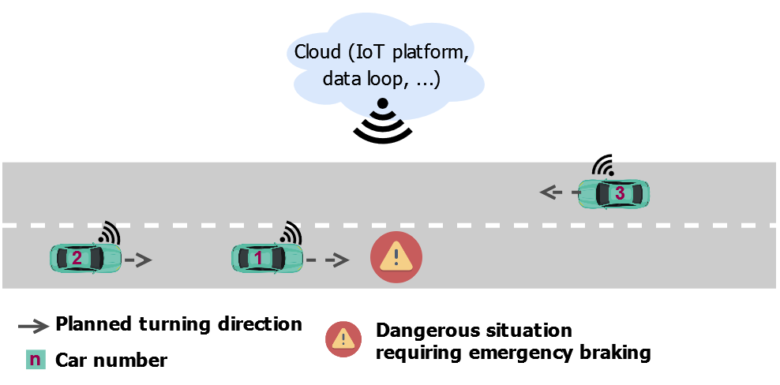

# Scenario: Intelligent emergency braking warning

## Overview

Three cars are driving on one road. Car1 brakes abruptly due to a dangerous situation (emergency brake) and notifies Car2 (driving behind Car1) and Car3 (coming from the opposite lane) to adjust their accelerations intelligently in order to be able to react in time and appropriately to the possible dangerous situation ahead.

### Important scenario timestamps

*Note: Messages are not part of the car data itself and must be simulated by an external real time data processing system like an IoT platform if wanted. However, the actions of the involved cars can be better explained as reactions of received messages.*

| Timestamp [s] | Action |\n| --- | --- |\n| 0 | Car1 and  Car3 enter the scenario | \n| 5 | Car2 enters the scenario |\n| 27.37 | Car1 performs an emergency braking (acceleration = -7.5625 m/s^2)\n| ~27.40 | Car3 receives msg: "Emergency braking on opposite lane. Slow down with acceleration = -3,55 m/s^2 to velocity = 29 km/h.", and slows down accordingly. | \n| 28.82 | Car1 stops (velocity = 0) |\n| 28.82 | Car2 receives msg: "Emergency braking on your lane ahead. Slow down with acceleration = -2.57 m/s^2 to 13 km/h.", and slows down accordingly. | \n| 37.82 | Car1 continues its drive (emergency situation is over) |\n| 38.92 | Car3 starts accelerating to velocity ~= 51 km/h |\n| 40.14 | Car2 starts accelerating to velocity ~= 40 km/h |\n| 52.83 | Scenario end: Car1 | \n| 55.08 | Scenario end: Car2 |\n| 55.33 | Scenario end: Car3 |

## Car data details

### Car1: Braking car

**Simulation data:** [car1.txt](./car1.txt)

**First appearance at simulation timestamp:** 0

| Properties | Configuration |
| --- | --- |
| **Make** | Audi |
| **Model** | A7 |
| **Start kilometrage [km]**  | 3430 |
| **License number** | S-CAR-001 |
| **Type of drive** | fuel |
| **Unit: length** | km |
| **Unit: velocity** | km/h |
| **Unit: acceleration** | m/s^2 |

### Car2: Car driving behind Car1

**Simulation data:** [car2.txt](./car2.txt)

**First appearance at simulation timestamp:** 5

| Properties | Configuration |
| --- | --- |
| **Make** | Volkswagen |
| **Model** | Golf |
| **Start kilometrage [km]**  | 52343 |
| **License number** | BB-CAR-002 |
| **Type of drive** | fuel |
| **Unit: length** | m |
| **Unit: velocity** | m/s |
| **Unit: acceleration** | m/s^2 |

### Car3: Car coming from the opposite lane

**Simulation data:** [car3.txt](./car3.txt)

**First appearance at simulation timestamp:** 0

| Properties | Configuration |
| --- | --- |
| **Make** | Ford |
| **Model** | Fiesta |
| **Start kilometrage [km]**  | 22345 |
| **License number** | LEO-CAR-003 |
| **Type of drive** | fuel |
| **Unit: length** | mi |
| **Unit: velocity** | mph |
| **Unit: acceleration** | ft/s^2 |